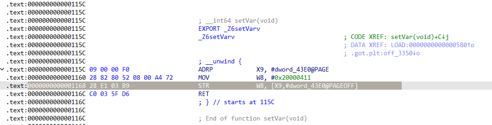

# 引言
这是一个Android Studio项目，使用系统调用来实现Android程序的硬件断点。不像rwProcMem33那样需要修改内核重新编译之类的复杂操作。
本项目仅适用于**ARM64架构程序！**
```C
static long perf_event_open(
        struct perf_event_attr *attr,
        pid_t pid,
        int cpu,
        int group_fd,
        unsigned long flags)
{
    return syscall(
            __NR_perf_event_open,
            attr,
            pid,
            cpu,
            group_fd,
            flags
    );
}
```
参数：
```C
long perf_event_open(
        struct perf_event_attr *attr,
        pid_t pid,
        int cpu,
        int group_fd,
        unsigned long flags);
```
# 使用
手机得是root的，执行以下命令行。
```Shell
echo -1 > /proc/sys/kernel/perf_event_paranoid
setenforce 0
```
还原：
```Shell
echo 3 > /proc/sys/kernel/perf_event_paranoid
setenforce 1
```
## 视使用场景修改代码
一是代码执行断点，二是内存访写断点。
### (1) 执行断点
`JNI_OnLoad`代码示例，位于`native-lib.cpp`：
```C
extern "C" JNIEXPORT jint JNICALL JNI_OnLoad(JavaVM* vm, void* reserved)
{
    LOGD("We're here to begin.");
    // HW_BREAKPOINT_X来自 #include <linux/hw_breakpoint.h>
    /*
     * 内存断点：
     * 更改结构体属性即可
        attr.bp_type = HW_BREAKPOINT_W;   // 或 HW_BREAKPOINT_R / HW_BREAKPOINT_RW
        attr.bp_addr = target_data_addr;  // 要监控的内存地址
        attr.bp_len  = HW_BREAKPOINT_LEN_4; // 操作多少个字节？
     * */
    start_perf((uint64_t)add, HW_BREAKPOINT_X);
    // Exec. Test: Call `add` for 3 times.
    add(333,444);
    add(111,222);
    add(33333,444);
    // Memory read test
    return JNI_VERSION_1_6;
}

// DO NOT INLINE A FUNCTION.
// To find the right address of `add`.
__attribute__((noinline))
int add(uint32_t n1, uint32_t n2)
{
    volatile uint32_t a = n1;
    volatile uint32_t b = n2;
    return a + b;
}
```
### (2) 内存访写断点
定义一个全局变量：
```C
static int karina = 0;
```
写个函数来修改它的值：
```C
void setVar(){
    karina = 0x20000411;
}
```
再监视：
```C
extern "C"
JNIEXPORT void JNICALL
Java_com_aespa_perf_1event_MainActivity_getRegs_1Mem(JNIEnv *env, jobject thiz) {
// 这是jni函数，可以放在按钮点击事件里调用。
    LOGD("call");
    LOGD("We're here to begin.");
    start_perf((uint64_t)&karina, HW_BREAKPOINT_W);
    setVar();
   return;
}
```
本项目代码还支持调用堆栈打印，只要修改`perfmap_new`的参数`backtrace`就行。
# 效果图
在logcat中显示各个寄存器的值。
## 执行断点
日志输出：
```
x0  = 0x000000000000014d
x1  = 0x00000000000001bc
x2  = 0x0000007047133500
x3  = 0x0000007047133588
x4  = 0x0000007047133500
x5  = 0x00000070eed421bc
x6  = 0x00000070471334f0
x7  = 0x0000000080000000
x8  = 0x0000000000000000
x9  = 0x2e069a0242bacfbe
x10 = 0x0000000000000004
x11 = 0x0000000080000000
x12 = 0x0000007047133500
x13 = 0x00000070471334f0
x14 = 0x0000000000004100
x15 = 0x0000007fff3f3b78
x16 = 0x000000704779b1a8
x17 = 0x0000007047798fb8
x18 = 0x0000007fff3f305a
x19 = 0x000000706ac14c00
x20 = 0x0000000000000000
x21 = 0x000000706ac14c00
x22 = 0x0000007fff3f4000
x23 = 0x00000070f245b493
x24 = 0x0000000000000004
x25 = 0x00000070f278c5e0
x26 = 0x000000706ac14ca0
x27 = 0x0000000000000001
x28 = 0x0000007fff3f3d30
fp = 0x0000007fff3f3d00
lr = 0x0000007047799058
sp = 0x0000007fff3f3cd0
pc = 0x0000007047798fb8
```
IDA调试断下时的截图：


## 内存访写
日志：
```
2026-05-26 17:47:54.656 24092-24092 PerfBP                  com.aespa.perf_event                 D  call
2026-05-26 17:47:54.656 24092-24092 PerfBP                  com.aespa.perf_event                 D  We're here to begin.
2026-05-26 17:47:54.656 24092-24252 PerfBP                  com.aespa.perf_event                 D  hit pid=24092 tid=24092
2026-05-26 17:47:54.656 24092-24252 PerfBP                  com.aespa.perf_event                 I  x0  = 0x00000070477a33e0
2026-05-26 17:47:54.656 24092-24252 PerfBP                  com.aespa.perf_event                 I  x1  = 0x0000000000000002
2026-05-26 17:47:54.656 24092-24252 PerfBP                  com.aespa.perf_event                 I  x2  = 0x0000000000000005
2026-05-26 17:47:54.656 24092-24252 PerfBP                  com.aespa.perf_event                 I  x3  = 0x0000000000000003
2026-05-26 17:47:54.656 24092-24252 PerfBP                  com.aespa.perf_event                 I  x4  = 0x0000000000000000
2026-05-26 17:47:54.656 24092-24252 PerfBP                  com.aespa.perf_event                 I  x5  = 0x6550ffffffffffff
2026-05-26 17:47:54.656 24092-24252 PerfBP                  com.aespa.perf_event                 I  x6  = 0x0000008000000000
2026-05-26 17:47:54.656 24092-24252 PerfBP                  com.aespa.perf_event                 I  x7  = 0x0000000080000000
2026-05-26 17:47:54.656 24092-24252 PerfBP                  com.aespa.perf_event                 I  x8  = 0x0000000020000411
2026-05-26 17:47:54.656 24092-24252 PerfBP                  com.aespa.perf_event                 I  x9  = 0x00000070477a3000
2026-05-26 17:47:54.656 24092-24252 PerfBP                  com.aespa.perf_event                 I  x10 = 0x0000007fff3f3760
2026-05-26 17:47:54.656 24092-24252 PerfBP                  com.aespa.perf_event                 I  x11 = 0x0000000000000015
2026-05-26 17:47:54.656 24092-24252 PerfBP                  com.aespa.perf_event                 I  x12 = 0x0101010101010101
2026-05-26 17:47:54.656 24092-24252 PerfBP                  com.aespa.perf_event                 I  x13 = 0x0000000000000020
2026-05-26 17:47:54.656 24092-24252 PerfBP                  com.aespa.perf_event                 I  x14 = 0xffffffffffffffff
2026-05-26 17:47:54.656 24092-24252 PerfBP                  com.aespa.perf_event                 I  x15 = 0x0000000000000018
2026-05-26 17:47:54.656 24092-24252 PerfBP                  com.aespa.perf_event                 I  x16 = 0x00000070477a2350
2026-05-26 17:47:54.656 24092-24252 PerfBP                  com.aespa.perf_event                 I  x17 = 0x00000070477a015c
2026-05-26 17:47:54.656 24092-24252 PerfBP                  com.aespa.perf_event                 I  x18 = 0x0000007fff3f305a
2026-05-26 17:47:54.656 24092-24252 PerfBP                  com.aespa.perf_event                 I  x19 = 0x000000706ac14c00
2026-05-26 17:47:54.656 24092-24252 PerfBP                  com.aespa.perf_event                 I  x20 = 0x0000000000000000
2026-05-26 17:47:54.656 24092-24252 PerfBP                  com.aespa.perf_event                 I  x21 = 0x000000706ac14c00
2026-05-26 17:47:54.656 24092-24252 PerfBP                  com.aespa.perf_event                 I  x22 = 0x0000007fff3f4000
2026-05-26 17:47:54.656 24092-24252 PerfBP                  com.aespa.perf_event                 I  x23 = 0x00000070f245b49f
2026-05-26 17:47:54.656 24092-24252 PerfBP                  com.aespa.perf_event                 I  x24 = 0x0000000000000004
2026-05-26 17:47:54.656 24092-24252 PerfBP                  com.aespa.perf_event                 I  x25 = 0x00000070f278c5e0
2026-05-26 17:47:54.656 24092-24252 PerfBP                  com.aespa.perf_event                 I  x26 = 0x000000706ac14ca0
2026-05-26 17:47:54.656 24092-24252 PerfBP                  com.aespa.perf_event                 I  x27 = 0x0000000000000001
2026-05-26 17:47:54.656 24092-24252 PerfBP                  com.aespa.perf_event                 I  x28 = 0x0000007fff3f3d30
2026-05-26 17:47:54.656 24092-24252 PerfBP                  com.aespa.perf_event                 I  fp = 0x0000007fff3f3d00
2026-05-26 17:47:54.656 24092-24252 PerfBP                  com.aespa.perf_event                 I  lr = 0x00000070477a01d4
2026-05-26 17:47:54.656 24092-24252 PerfBP                  com.aespa.perf_event                 I  sp = 0x0000007fff3f3cd0
2026-05-26 17:47:54.656 24092-24252 PerfBP                  com.aespa.perf_event                 I  pc = 0x00000070477a0168
```
代码截图：

偏移和图中是一样的。


